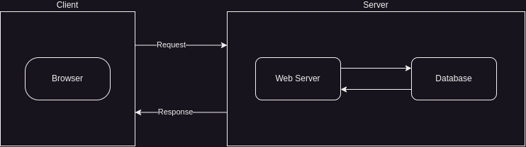

# RESTful API Theory

## What is a request?
A request is a message sent from a client to a server to perform an action. In the context of RESTful APIs, a request is typically an HTTP request that contains information about the action to be performed on a resource. There are several types of HTTP requests. If we load a webpage in the browser, the browser sends a GET request to the server to retrieve a HTML file, this file is then rendered by the browser as a webpage. If we submit a form on a webpage, the browser sends a POST request to the server to submit the form data. Similarly, we have PUT and DELETE requests to update and delete resources, respectively.

## What is a response?
A response is a message sent from a server to a client in response to a request. In the context of RESTful APIs, a response is typically an HTTP response that contains information about the result of the action performed on a resource. The response can include data, status codes, headers, and other information that the client can use to process the response. For example, if we send a GET request to retrieve a list of users, the server will respond with a JSON object containing the user data. If we send a POST request to create a new user, the server will respond with a status code indicating the success or failure of the operation.

## What is a resource?
A resource is an object or entity that can be accessed and manipulated by a client through a RESTful API. Resources can be anything from users, products, orders, to blog posts, comments, and more. Each resource is identified by a unique URI (Uniform Resource Identifier) that the client can use to interact with the resource. For example, a user resource might have the URI `/users/{id}` where `{id}` is the unique identifier of the user. Resources can be created, read, updated, and deleted using standard HTTP methods like GET, POST, PUT, DELETE.

## Example:
Let's consider an example of a simple RESTful API for managing users. The API exposes the following resources:
- `/users`: A collection of users
- `/users/{id}`: A specific user identified by `{id}`

The API supports the following operations on users:
- `GET /users`: Retrieve a list of users (Read operation)
- `POST /users`: Create a new user (Create operation)
- `GET /users/{id}`: Retrieve a specific user (Read operation)
- `PUT /users/{id}`: Update a specific user (Update operation, Replace operation) - PUT replaces the entire resource
- `PATCH /users/{id}`: Update a specific user (Update operation, Modify operation) - PATCH modifies part of the resource
- `DELETE /users/{id}`: Delete a specific user (Delete operation)

Each operation corresponds to a CRUD (Create, Read, Update, Delete) operation on the user resource. The API uses standard HTTP methods to perform these operations and standard HTTP status codes to indicate the success or failure of the operations.

